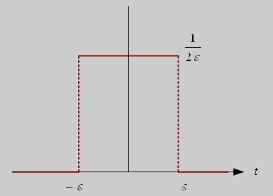

<!--
class: title
_paginate: false
-->

# アナログ変調方式と振幅変調方式

A1778594 池田 力

---
<!--
_header: 前回の宿題
footer: 振幅変調方式とアナログ変調方式
class: contents
-->
### $\delta$関数を用いて信号を取り出せることを証明する

$$\int_{ -\infty }^{ \infty }{ f(x)\delta(x - x_1) } = f(x_1)$$

$\delta$関数を以下のグラフになるように定義する

<a href="https://www.mnc.toho-u.ac.jp/v-lab/yobology/delta_function/delta_function.htm">https://www.mnc.toho-u.ac.jp/v-lab/yobology/delta_function/delta_function.htm</a> より引用

---
<!--
_header: 前回の宿題
-->
$\delta$関数のグラフから以下のように変形する
$$
\int_{ -\infty }^{ \infty }{ f(x)\delta(x - x_1)dx } = \lim_{ \varepsilon \rightarrow 0}{\frac{1}{2\varepsilon} \int_{ x_1 - \varepsilon }^{ x_1 + \varepsilon }{f(x)dx} }
$$

平均値の定理より$\displaystyle \int_{ x_1 - \varepsilon }^{ x_1 + \varepsilon }{ f(x)dx } = 2 \varepsilon f(\xi)$ なる $x_1 - \varepsilon < \xi < x_1 + \varepsilon$ が存在する
$\varepsilon → 0$ のとき、 $\xi → x_1$ となるから
$$
\begin{aligned}
\int_{ -\infty }^{ \infty }{ f(x)\delta(x - x_1)dx } &= \lim_{ \varepsilon \rightarrow 0}{\frac{1}{2\varepsilon} \int_{ x_1 - \varepsilon }^{ x_1 + \varepsilon }{f(x)dx} } \\[1em]
&= \lim_{ \varepsilon \rightarrow 0}{\frac{1}{2\varepsilon} 2 \varepsilon f(\xi) }
= \lim_{ \varepsilon \rightarrow 0}{ f(\xi) }
= f(x_1)
\end{aligned}
$$

参考文献: <a href="https://www.mnc.toho-u.ac.jp/v-lab/yobology/delta_function/delta_function.htm">https://www.mnc.toho-u.ac.jp/v-lab/yobology/delta_function/delta_function.htm</a>

---
<!--
_header: アナログ変調方式
-->

### 搬送波は一般的に以下のように表すことができる
$$
s(t) = A \cos(2 \pi f_c t + \phi)
$$

### 変調方式には搬送波のパラメータを変化させる方法により3種類ある
  - **振幅変調方式** (Amplitude Modulation)
     - 振幅 $A$ を変化させて情報を伝える
  - 角度変調方式
     - **周波数変調方式** (Frequency Modulation)
        - 周波数 $f_c$ を変化させて情報を伝える
     - **位相変調方式** (Phase Modulation)
        - 位相 $\phi$ を変化させて情報を伝える

---
<!--
_header: アナログ変調方式
-->
### 信号は以下の手順で送信者から受信者へ伝わる
- **変調し送信される**
- 伝送路を通る(ノイズが入る)
- アンテナで受信
- 復調し元の信号を取り出す

---
<!--
_header: 振幅変調方式
-->

### 今回は振幅変調方式に限って、搬送波 $s_{AM}(t)$ の数式を導出する
- 振幅変調方式は最も単純で古くから実用化されていた技術
- 変調信号(伝えたい信号) $v(t)$, 変調指数 $k$ のとき、変調後の搬送波は以下となる
  $$ s_{AM}(t) = A_0 \{1 + k v(t)\} \cos{(2 \pi f_c t + \phi)}$$

---
<!--
_header: 振幅変調方式
-->

### $k > 1$ の状態を過変調と呼ぶ
- 上の包絡線と下の包絡線が交差しており、信号処理がめんどくさくなる
  
- 信号処理を単純にするため、普通 $k < 1$ で設計する

---
<!--
_header: 振幅変調方式: スペクトル上の関係とベクトル図
-->

### 変調後の搬送波を周波数成分に分解する
- 変調信号 $v(t) = \cos{(2 \pi f_m t + \theta)}$ とする
- 搬送波 $s(t) = A \cos(2 \pi f_c t)$ とする

$s_{AM}(t) = A_0 \{1 + k v(t)\} \cos{(2 \pi f_c t + \phi)}$ に代入して、
$$
\begin{aligned}
s_{AM}(t) &= A_0 \{1 + k \cos{(2 \pi f_m t + \theta )} \} \cos{2 \pi f_c t}\\[0.5em]
&= {A_0 \cos{2 \pi f_c t}} \cdots \text{元の搬送波成分} \\
&\qquad +\frac{A_0 k}{2} \cos{\{2 \pi (f_c + f_m)t + \theta\}} \cdots \text{上側波帯}\\
&\qquad +\frac{A_0 k}{2} \cos{\{2 \pi (f_c - f_m)t + \theta\}} \cdots \text{下側波帯}
\end{aligned}
$$

---
<!--
_header: 振幅変調方式: スペクトル上の関係
_class: contents wide-margin-list
-->

### 変調後の搬送波を周波数成分に分解する
- 変調信号 $v(t) = \cos{(2 \pi f_m t + \theta)}$
- 搬送波 $s(t) = A \cos(2 \pi f_c t)$
- 上側波帯 $\displaystyle \frac{A_0 k}{2} \cos{\{2 \pi (f_c + f_m)t + \theta\}}$
- 下側波帯 $\displaystyle \frac{A_0 k}{2} \cos{\{2 \pi (f_c - f_m)t + \theta\}}$

---
<!--
_header: 振幅変調方式: ベクトル図
_class: wide-margin-list contents
-->

### ベクトル図を使って合成成分を図示する
- 搬送波: $\overrightarrow{OA} = A \cos(2 \pi f_c t)$
- 上側波帯: $\overrightarrow{AC} = \displaystyle \frac{A_0 k}{2} \cos{\{2 \pi (f_c + f_m)t + \theta\}}$
- 下側波帯: $\overrightarrow{AB} = \displaystyle \frac{A_0 k}{2} \cos{\{2 \pi (f_c - f_m)t + \theta\}}$

- 図から、$\overrightarrow{OD} = \overrightarrow{OA} + \overrightarrow{AC} + \overrightarrow{AB}$ であり、$D$ は $F$ と $E$ の間を直線上に移動するだけである。  $\Leftrightarrow$ **搬送波の周波数は変化しない**

---
<!--
_header: まとめ
-->

- 変調後の搬送波は以下の式で表すことができる
  $$ s_{AM}(t) = A_0 \{1 + k v(t)\} \cos{(2 \pi f_c t + \phi)}$$
- 変調後の搬送波は**3つの周波数成分の和**で表すことができる
  $${A_0 \cos{2 \pi f_c t}} + \frac{A_0 k}{2} \cos{\{2 \pi (f_c + f_m)t + \theta\}} +\frac{A_0 k}{2} \cos{\{2 \pi (f_c - f_m)t + \theta\}}$$
- 位相・周波数を固定したまま振幅を変化させることができる
